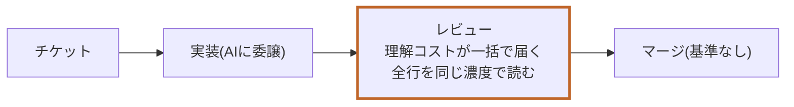
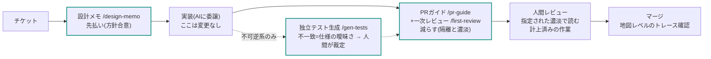

# 導入前後のフロー比較 — 理解コストの引っ越し

[基準(standard.md)](standard.md)+[スキル4本](skills/)を導入すると、開発フローの何が変わるか。変わるのは作業の速さではなく、**理解コストが発生する場所**と、**人間の判断が置かれる場所**である。

## 全体像

**従来:** 実装が理解の時間を兼ねなくなった結果、理解コストの請求がレビューの席に一括で届く。

**導入後:** 理解コストを「先払い・減らす・計上する」の三箇所に分散する。

## 段階別の変化

**▲**=従来の痛点 / **`/skill`**=スキルが下書き・機械検査 / **【人間】**=空欄として残る判断(Human-in-the-Loop)

| 段階 | 従来 | 導入後 |
|---|---|---|
| **着手** | チケットを読んですぐAIに投げる。方針は頭の中で、チームに共有されない。 ▲ 文脈が個人に閉じる | 10行の方針メモを流して異論を確認(10〜15分)。文脈の先払い。 `/design-memo`【人間: 合意】 |
| **実装** | AIに委譲 | AIに委譲。**ここは何も変わらない**——委譲をやめる基準ではない |
| **テスト** | 実装と同じセッションがテストも書く。 ▲ 実装に合わせたテストが通るだけ(同語反復) | 不可逆系のみ、実装を見せない別セッションが仕様から生成。落ちたテスト=仕様が2通りに読めた証拠。 `/gen-tests`【人間: 裁定】 |
| **PR作成** | 説明が薄い、またはAIの冗長な長文。 ▲ レビュアーが文脈ゼロから読む | 機械記入欄は下書き、レビューの濃淡(行/構造/契約)を提案。「一番怪しい箇所」「捨てた選択肢」はAIが埋めない——著者の理解度テストを兼ねる。 `/pr-guide`【人間: 怪しい箇所の名指し】 |
| **レビュー** | 全行を同じ濃度で読む(または感覚で流す)。 ▲ 負担が見積りに存在しない ▲ 読む深さが属人的 | 機械検査はAIが先に潰し、人間は指定された濃淡で設計判断・契約の妥当性・行レベル箇所だけを読む。レビューは見積りに計上された作業になる。 `/first-review`【人間: 設計と契約の判断】 |
| **マージ** | 「テスト通ってるからヨシ」。 ▲ 基準がなく、不安か過信の二択 | 基準:障害時に「どの箱が壊れたか」言えるか(全行トレースではなく地図レベル)。マージ=一次対応責任の宣言。 【人間: 決断(責任)】 |
| **障害対応** | エージェントに聞くしかない。何を聞けばいいかも分からない。 ▲ 理解の単一障害点 | 地図(§11)で壊れた箱を特定し、必要な箇所だけAIと降りる。緩和と修正を分離できる。記録を地図へ書き戻す。 【人間: 仮説と切り分け】 |

## 正直な収支

導入はタダではない。増える手間を隠さずに置く。

| 増える手間 | 減るもの | 変わらないもの |
|---|---|---|
| 設計メモ 10〜15分/チケット | 文脈ゼロからのレビュー読解 | 実装をAIに委譲すること |
| PRの空欄2つを自分で書く | 全行精読(濃淡の指定で置換) | 判断と責任が人間にあること(空欄として見える形になるだけ) |
| 障害記録 1行/件 | テストの同語反復 | 守られない項目は削る、という改訂前提 |
| 目安: チケットあたり+20分前後 | マージ時の根拠のない不安/障害時の「聞くしかない」状態 | |

---

*この図は導入判断用の要約であり、正確な定義は[基準本文](standard.md)が優先。*
