# スキル群 — 基準を「読む」から「実行する」へ

[基準本文](../standard.md)の運用部分を、コーディングエージェントのスキル(手順書)として実装したもの。基準は覚えて守るものではなく、`/design-memo` と打てば始まるものにする。

## まず /flow

スキルを1本ずつ手で呼ぶ運用は、忙しい日に最初に消える。**`/flow <TICKET-ID>` は、機械でできる工程を連続実行し、人間の判断が必要な**停止**でまとめて聞く。** 停止は標準ケースで**3回**(着手/PR確認/マージ)——👤 ゲートの数は減らさず、聞く場所を束ねてある。状態はリポジトリの外(`~/.flow/<リポジトリ名>/<TICKET-ID>.md`)に持つので、人間が答えてもう一度呼べば続きが走る(実装完了後の継続呼び出しは判断ゼロ。完了通知が届く環境では自動)。

`flow` 自身は規範を持たない。下の5本を基準の順序で呼び、状態と実測を記録するだけである。

## フロー(/flow が進める順序)

赤が 👤(人間の判断。全10個)、黄が人の申告・作業(判断ではない)、灰が機械。図は工程名だけで、各工程の注記の正本は [flow のテンプレート](flow/assets/flow-template.md) と各スキルにある。

```mermaid
flowchart TD
  classDef human fill:#fde2e2,stroke:#c0392b,color:#000
  classDef machine fill:#eef2f7,stroke:#5d6d7e,color:#000
  classDef ask fill:#fff8dc,stroke:#b7950b,color:#000

  subgraph S1["停止1: 着手(1回の停止でまとめて聞く)"]
    direction TB
    dm["/design-memo 設計メモの下書き"]:::machine
    g1["👤 設計メモへの合意(不可逆系は明示承認)"]:::human
    hd["ヘッダへの申告: 設計メモの在り処と承認・実データの所在・結合テストの実行手段"]:::ask
    c0["/crosscheck 手順0 検査の段と版の判定"]:::machine
    dl["実装の委譲(実装・単体テスト・結合テストまで。送信のみ)"]:::machine
    b1["/crosscheck 手順B-1 自動版の生成(テストコード / 結合テスト仕様書)"]:::machine
    g2["👤 理解検査: 期待値の書き出し(著者。実装と並列)"]:::human
    g2b["👤 独立照合・人間版: 期待値(第二解釈者。別の停止)"]:::human
    dm --> g1 --> hd --> c0 --> dl --> b1 --> g2
    dl -.実装と並列.-> g2b
  end

  wait(["実装の完了待ち → 継続呼び出し(判断ゼロ)"])

  subgraph C["継続呼び出し(機械)"]
    direction TB
    done["完了確認(結合テストの有無・結果)"]:::machine
    area["領域の仮決め(diff から)"]:::machine
    um1["/update-map 初版生成(領域の初回のみ)"]:::machine
    cc["/crosscheck 理解検査の突き合わせ(種別は提案)・自動版テストコードの実行"]:::machine
    out["出力との突き合わせ(計測・集計系のみ)"]:::machine
    pg["/pr-guide 機械記入欄の下書き"]:::machine
    um2["/update-map 地図の更新をPRに同梱(契約等を変えた場合)"]:::machine
    fr["/first-review AI一次レビュー(別セッション)"]:::machine
    done --> area --> um1 --> cc --> out --> pg --> um2 --> fr
  end

  subgraph S2["停止2: PR確認(提示順を守る。記録が済むまで first-review を開かない)"]
    direction TB
    rd["完了報告の「迷った箇所」を読む"]:::ask
    sp["結合テスト仕様書の実行と記入(著者。仕様書のときのみ)"]:::ask
    g3["👤 種別(A/B)の確定とBの反映先"]:::human
    bd["「固定した / しなかった境界」を読む"]:::ask
    g4["👤 採らなかった選択肢の選別"]:::human
    g5["👤 理解レベルの確定(裁定なしの場合)"]:::human
    g6["👤 触る領域の確定"]:::human
    g7["👤 地図の初版を検収(初回のみ)"]:::human
    open["first-review の出力を開示"]:::machine
    post["Bの転記・PR欄の再生成・欄の突き合わせ検査"]:::machine
    rd --> sp --> g3 --> bd --> g4 --> g5 --> g6 --> g7 --> open --> post
  end

  subgraph R["人間レビュー(独立照合をやる場合のみ)"]
    direction TB
    mt["/crosscheck 人間版の突き合わせ"]:::machine
    g8["👤 食い違いの裁定(仕様の持ち主)"]:::human
    wb["裁定の書き戻し(仕様・テスト・地図)"]:::machine
    g9["👤 理解レベルの確定(裁定後。上と同じゲート)"]:::human
    mt --> g8 --> wb --> g9
  end

  subgraph S3["停止3: マージ"]
    g10["👤 マージの決断"]:::human
  end

  after["障害対応後・月イチ: /update-map 更新と矛盾検査(所有と裁定は人間)"]:::machine

  S1 --> wait --> C --> S2 --> R --> S3
  S3 -.-> after
```



## 設計思想:空欄がHuman-in-the-Loopの定義

スキルが自動化するのは**準備・機械検査・判断の候補提示まで**。判断——設計メモへの合意、「採らなかった選択肢」の選別、独立照合の食い違いの裁定、理解レベルの確定、マージの決断——は、出力の**空欄**として人間に残す。

ただし、**担当は「著者か機械か」の2区分では決まらない。欄や工程が知識と判断のどちらに基づくかで決まる**(基準[§7](../standard.md#s7)・[§9](../standard.md#s9)):

| 種類 | 担当 | 例 |
|---|---|---|
| 作業から得られる知識 | **やった側**(実装したエージェントの申告、結合テスト仕様書を実行した著者の観測) | 完了報告の「迷った箇所・仕様が薄く補完した箇所」(著者が停止2の先頭で読む)・「結合テストで固定した境界・固定しなかった境界」(種別確定の後で読む) |
| 記録からの転記 | **機械**(生成は不可のまま。可否を人に聞かない——聞くこと自体が人を止める) | 「採らなかった選択肢」の候補 |
| 価値判断・裁定 | **人間** | 食い違いの裁定・欄の確定・マージの決断 |
| 選択肢が実質1つの決定 | **機械が決めて根拠を記録し、人が見て止める**(「機械が決めた」と明記) | 一人運用時の領域の決定 |

空欄は手抜きではなく仕様である。全部自動化しようとして、原理的に自動化できずに残った箇所が、このフローにおける人間の担当の定義になっている。

**空欄は強制ではなく規約である**——守らせる力は仕組みではなく口頭確認にあり、スキルが保証するのは正規のフロー自体が形骸化の供給源にならないことまで(基準[§9](../standard.md#s9))。

運用が乗ったら、空欄の扱われ方自体を観察してほしい。ある空欄が毎回そのまま素通りしているなら、可能性は2つ——**偽のHITLポイント**(実は人間が要らなかった → 欄を削る=権限移譲の実績判断)か、**萎え始めた本物**(判断すべきなのに省略され始めた → 訓練対象)。どちらかをチームで判定する。基準[§7](../standard.md#s7)「実績が出た方向に権限を移す」を、空欄単位で実行する仕組みである。

## 導入

SKILL.md形式は [Agent Skills Open Standard](https://agentskills.io) としてClaude Code・Codex CLI・Cursor等の多数のエージェントに採用されている。**中身の書き換えは不要で、コピー先だけが違う。** pr-guideが参照するPRテンプレートは `pr-guide/assets/` に同梱してあり、ディレクトリごとコピーすれば動く(このリポジトリでもこれが正本)。crosscheck のツール制限付きサブエージェント定義は SKILL.md 内の例を `.claude/agents/` に置く。

```bash
# Claude Code
cp -r skills/flow skills/design-memo skills/crosscheck skills/pr-guide skills/first-review skills/update-map <your-repo>/.claude/skills/

# Codex CLI(.agents/skills/ を走査する。公式: https://developers.openai.com/codex/skills)
cp -r skills/flow skills/design-memo skills/crosscheck skills/pr-guide skills/first-review skills/update-map <your-repo>/.agents/skills/
```

上記以外のエージェントでも、各 `SKILL.md` の本文は製品非依存の手順書として書かれているため、カスタム指示・プロンプトとしてそのまま移植できる。
